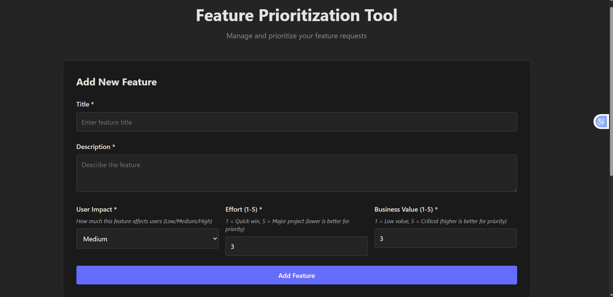
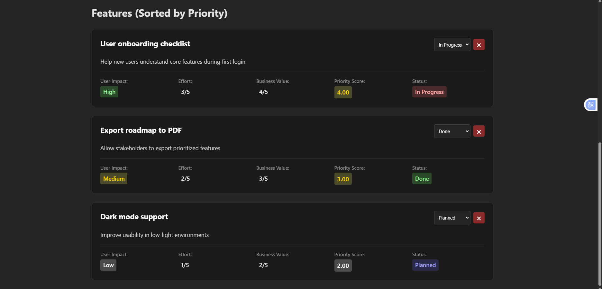

# Feature Prioritization Tool

An internal MVP tool for startups and product teams to systematically prioritize feature requests based on business value, user impact, and development effort.

## Screenshots

## Problem Statement

Startups and product teams face a constant challenge: too many feature ideas, limited development resources, and no clear framework for deciding what to build next. Without a structured approach, teams often:

- Build features based on the loudest voice in the room
- Struggle to balance user needs with business objectives
- Miss quick wins that could deliver high value with low effort
- Lack visibility into why certain features are prioritized over others

This tool solves these problems by providing a simple, transparent framework for feature prioritization that combines multiple factors into a single, actionable priority score.

## Target Users

**Primary Users:**

- Product Managers and Product Owners managing feature backlogs
- Startup founders making early product decisions
- Small product teams (2-10 people) without dedicated product management tools
- Engineering leads who need to communicate priorities to stakeholders

**Use Case:**
Internal tool for teams that need a lightweight, no-frills solution for feature prioritization without the complexity and cost of enterprise product management platforms.

## Key Features

### 📝 Feature Management

- **Add Feature Requests**: Capture new feature ideas with title, description, and key metrics
- **Track Status**: Monitor features through their lifecycle (Backlog → Planned → In Progress → Done)
- **Update Anytime**: Modify feature details or status as requirements evolve

### 🎯 Automatic Prioritization

- **Smart Scoring**: Features are automatically scored based on three key factors:
  - **User Impact**: How much the feature affects users (Low, Medium, High)
  - **Business Value**: Strategic importance to the business (1-5 scale)
  - **Effort**: Development complexity and time required (1-5 scale)
- **Sorted Display**: Features are automatically sorted by priority score, so the most important items appear first

### 💾 Data Persistence

- **Local Storage**: All features are automatically saved in your browser
- **No Backend Required**: Works completely offline, no server or database needed
- **Session Continuity**: Your data persists between browser sessions

### 🎨 User Experience

- **Clear Visual Indicators**: Color-coded badges show impact levels, priority scores, and status at a glance
- **Helper Text**: Guidance on how to evaluate each metric
- **Empty States**: Clear messaging when starting fresh
- **Confirmation Dialogs**: Prevents accidental deletions

## How Priority is Calculated

The priority score uses a simple but effective formula that balances multiple factors:

**Priority Score = (Business Value × User Impact Multiplier) ÷ Effort**

### The Formula Explained

1. **Business Value (1-5)**: How strategically important this feature is to the business

   - 1 = Nice to have, low strategic value
   - 5 = Critical for business goals, high strategic value

2. **User Impact Multiplier**: How much the feature affects users

   - Low = 1x multiplier
   - Medium = 2x multiplier
   - High = 3x multiplier

3. **Effort (1-5)**: How much development work is required
   - 1 = Quick win, minimal effort
   - 5 = Major project, significant effort

### Why This Works

The formula naturally favors **high-value, high-impact features that are quick to build** (the classic "quick wins"). It penalizes high-effort features unless they deliver exceptional value and impact.

**Example:**

- Feature A: Business Value 5, High Impact (×3), Effort 2
  - Score = (5 × 3) ÷ 2 = **7.5** (High Priority)
- Feature B: Business Value 3, Medium Impact (×2), Effort 5
  - Score = (3 × 2) ÷ 5 = **1.2** (Lower Priority)

This ensures teams focus on features that deliver maximum value with efficient use of resources.

## Product Decisions and Trade-offs

### Why localStorage for Data Storage?

**Decision**: Store all data in the browser's localStorage instead of a backend database.

**Rationale**:

- **Speed to Market**: No backend infrastructure means the MVP can be built and deployed in days, not weeks
- **Zero Operational Cost**: No servers, databases, or hosting fees
- **Works Offline**: Perfect for teams that need reliability without network dependencies
- **Simple Deployment**: Can be hosted as a static site (GitHub Pages, Netlify, Vercel)

**Trade-offs**:

- ✅ **Acceptable for MVP**: Data is browser-specific (not synced across devices)
- ✅ **Acceptable for MVP**: Single-user experience (no real-time collaboration)
- ✅ **Acceptable for MVP**: ~5-10MB storage limit (sufficient for hundreds of features)

**Future Consideration**: For production with multiple users, a backend API with database would be necessary.

### Why a Simple Priority Formula?

**Decision**: Use a straightforward mathematical formula instead of complex weighted scoring or machine learning.

**Rationale**:

- **Transparency**: Team members can understand and trust the prioritization logic
- **Predictability**: Product managers can estimate priority scores before adding features
- **Debate-Friendly**: Simple formula makes it easy to discuss and refine inputs
- **No Black Box**: Everyone can see why Feature A ranks higher than Feature B

**Trade-off**: Simpler formula may not capture all nuances, but for an MVP, clarity and trust outweigh complexity.

### Why No User Authentication?

**Decision**: Single-user tool with no login or authentication system.

**Rationale**:

- **Internal Tool**: Designed for single teams or individuals, not public-facing
- **Faster Development**: Authentication adds significant complexity and time
- **Lower Barrier**: No sign-up friction means immediate value

**Trade-off**: Not suitable for multi-tenant or public use cases, but perfect for internal MVP needs.

### Why Native Browser Confirmations?

**Decision**: Use browser's native `window.confirm()` for delete confirmations instead of custom modals.

**Rationale**:

- **MVP Speed**: Native dialogs work immediately, no custom component development
- **Zero Dependencies**: No UI library needed
- **Familiar UX**: Users recognize and trust native browser dialogs

**Trade-off**: Less customizable, but sufficient for MVP. Custom modals can be added later if needed.

## What Would Be Built Next

### Phase 2: Collaboration Features

- **Multi-user Support**: Backend API with user authentication
- **Real-time Updates**: See changes from team members instantly
- **Comments & Discussions**: Add context and debate around features
- **User Roles**: Product Manager, Developer, Stakeholder permissions

### Phase 3: Enhanced Prioritization

- **Custom Weighting**: Allow teams to adjust formula weights (e.g., prioritize effort more)
- **Multiple Scoring Models**: RICE, Value vs. Effort, Kano Model options
- **Historical Data**: Track how priority scores change over time
- **Impact Validation**: Compare predicted impact vs. actual user feedback post-launch

### Phase 4: Workflow Integration

- **Export Options**: CSV, JSON exports for reporting and analysis
- **Integration APIs**: Connect with Jira, Linear, GitHub Issues
- **Roadmap View**: Visual timeline of planned features
- **Sprint Planning**: Group features into sprints and track velocity

### Phase 5: Analytics & Insights

- **Feature Analytics**: Track completion rates, time-to-market
- **Priority Accuracy**: Measure if high-priority features actually delivered value
- **Team Metrics**: Velocity, throughput, and planning accuracy
- **Retrospectives**: Learn from prioritization decisions

## Getting Started

1. **Install Dependencies**: `npm install`
2. **Start Development Server**: `npm run dev`
3. **Build for Production**: `npm run build`

The tool runs entirely in the browser—no backend setup required.

## Philosophy

This tool embodies the MVP principle: **solve the core problem with the simplest solution possible**. Every feature decision prioritizes speed, clarity, and user value over technical sophistication. It's built for teams that need to prioritize features, not manage complex product management workflows.

---

**Built for startups, by product people who understand that sometimes the best tool is the one that gets out of your way and helps you make better decisions.**

